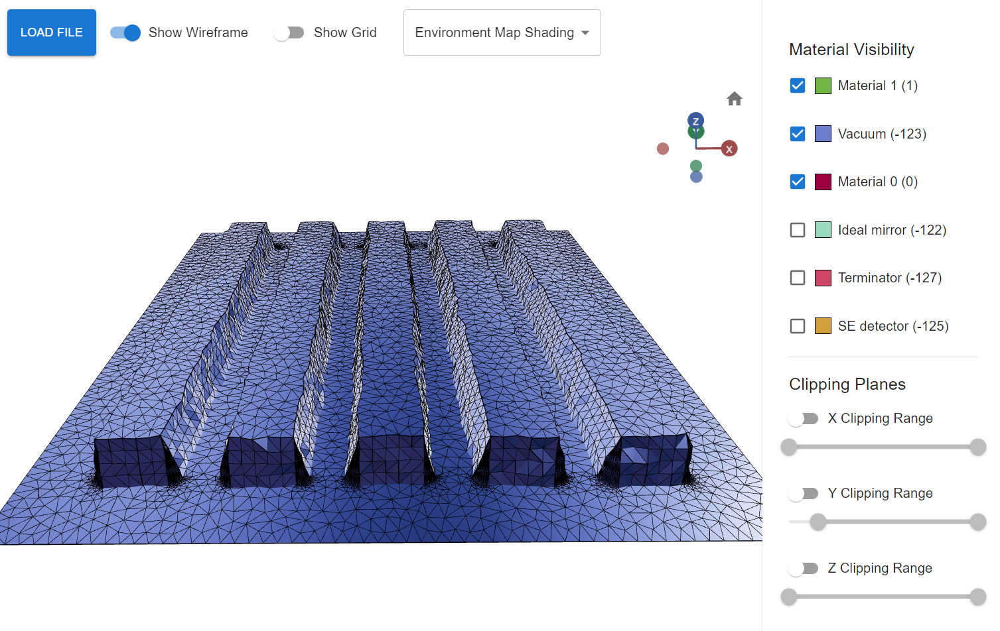

# Nebula Geometry Viewer

The Nebula Geometry Viewer is a 3D visualization tool designed to inspect geometries created for the Nebula electron-matter interaction simulator. This static web application, built with React and Three.js Fiber, allows users to load and explore `.tri` files in the Nebula geometry format.



## Features

- **3D Model Visualization**: Load Nebula `.tri` files and visualize the 3D models.
- **Material Visibility**: Adjust the visibility of different materials within the model.
- **Clipping Planes**: Control clipping planes to inspect the interior of the model.
- **Wireframe and Grid Display**: Show wireframe and x-y-grid for better spatial understanding.
- **Shading Options**: Change shading to better visualize rough surfaces.

## Installation

1. Clone the repository:
   ```bash
   git clone https://github.com/maxbarnikol/nebula-viewer.git
   ```
2. Navigate to the project directory:
   ```bash
   cd nebula-viewer
   ```
3. Install dependencies:
   ```bash
   npm install
   ```
4. Start the application:
   ```bash
   npm run dev
   ```

## Usage

- Load `.tri` files to begin visualizing the geometry.
- Use the interface to adjust material visibility and clipping planes.
- Toggle wireframe and grid views for enhanced visualization.
- Experiment with different shading options to highlight surface details.

To quickly test the viewer, you can use the sample `.tri` file provided by Nebula:
- Download the sample file from: https://nebula-simulator.github.io/data/tutorial/sem.tri
- Load this file into the viewer to explore a pre-made geometry

## Online Viewer

You can use a deployed version of the viewer at [this link](https://ambitious-cliff-0dbde3d03.5.azurestaticapps.net/).

## Resources

- **Nebula Simulator**: [GitHub Repository](https://github.com/Nebula-simulator/Nebula)
- **Nebula Documentation**: [Documentation Site](https://nebula-simulator.github.io/)
- **Nebula Geometry Format**: [Format Documentation](https://nebula-simulator.github.io/nebula-format-tri/)

## Acknowledgments

The code for this project was largely generated using Claude and GPT-4 models with the help of the awesome [Cursor IDE](https://cursor.com).

We would like to acknowledge:
- The authors and contributors of the Nebula simulator
- The developers of various packages used in this project
